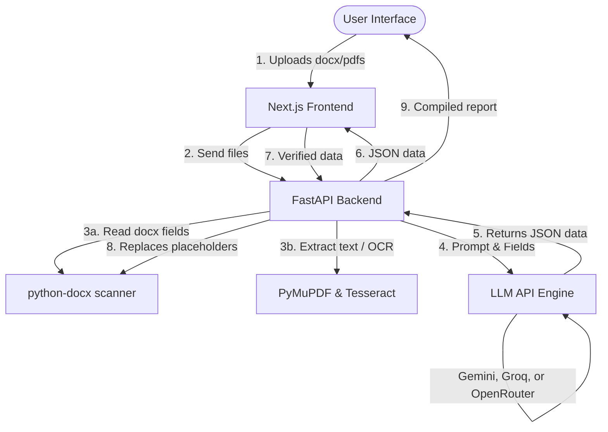

# 📝 GLR Claims Portal: Automated Insurance Template Filler Web-App

Automate Guideline Loss Report (GLR) template filling using photo reports and LLMs via a sleek, professional, and fully responsive React (Next.js) & FastAPI (Python) web application.

---

## 📖 Table of Contents
1. [What is GLR?](#-what-is-glr)
2. [What the Project Does](#-what-the-project-does)
3. [Core Features](#-core-features)
4. [Project Architecture & Tech Stack](#-project-architecture--tech-stack)
5. [APIs Integrated & Their Roles](#-apis-integrated--their-roles)
6. [Detailed Working Process](#-detailed-working-process)
7. [Directory Layout](#-directory-layout)
8. [Setup & Running Instructions](#-setup--running-instructions)
9. [Future Add-ons](#-future-add-ons)

---

## 🏢 What is GLR?
**GLR** stands for **Guideline Loss Report**. 

In the insurance claims and property restoration industry, whenever a home or business experiences damage (water, fire, wind, etc.), field inspectors or contractors compile site logs, equipment readings, and photos into a PDF report. Adjusters then have to manually copy-paste this information into a standardized Microsoft Word template (the GLR) to submit to insurance carriers. This portal automates that entire transcription process.

---

## ⚙️ What the Project Does
The portal provides an intuitive web-based interface where users upload a Word template and multiple PDF reports. The application automatically:
1. **Scans** the Word document dynamically to find empty placeholders.
2. **Extracts** text from the PDF reports (using standard extraction with OCR fallback for scans).
3. **Uses LLM APIs** to map raw PDF contents to the target Word placeholders.
4. **Groups fields** into an interactive tabbed review layout for manual verification.
5. **Generates & streams** a completed Word report preserving original styling.

---

## ✨ Core Features
*   **Dynamic Template Scanning**: No hardcoded schemas. The app extracts brackets `[FIELD]` or curly-braces `{{FIELD}}` dynamically.
*   **Intelligent OCR Fallback**: Falls back page-by-page to **Tesseract OCR** if a PDF contains only scanned documents/images.
*   **Tri-Provider LLM Engine**: Supports Google Gemini, Groq, and OpenRouter for high-speed, cost-effective extraction.
*   **Keyless Client Operation**: Uses server-side environmental configurations if keys are preloaded in [backend/.env](file:///c:/Users/alimo/OneDrive/Desktop/ImageFusion-Detection-AI-Tasks-main/GLR-Pipeline-Automation/backend/.env).
*   **Tabbed Verification Interface**: Dynamically filters fields into intuitive tabs ("Loss & Claims", "Insured & Property", "Mortgage & Vendor") with live progress indicators.
*   **Run Merging & Styling Preservation**: Replaces template fields at the paragraph level, preventing Microsoft Word from splitting brackets across runs and breaking font layouts.
*   **Elegant & Responsive Layout**: Clean Light Slate & Indigo stylesheet without heavy Tailwind utilities.

---

## 🏗️ Project Architecture & Tech Stack



### 💻 Frontend
*   **Framework**: Next.js 15 (App Router, React 19, TypeScript)
*   **Styling**: Custom CSS ([globals.css](file:///c:/Users/alimo/OneDrive/Desktop/ImageFusion-Detection-AI-Tasks-main/GLR-Pipeline-Automation/frontend/app/globals.css)) with custom animations (radar sweep, glassmorphism card borders, hover states).
*   **Icons**: Lucide React.

### 🐍 Backend
*   **Framework**: FastAPI (Python 3.10+) & Uvicorn ASGI Server.
*   **Libraries**:
    *   `python-docx` (Microsoft Word processing engine)
    *   `PyMuPDF` / `fitz` (Digital PDF processing)
    *   `pytesseract` & `Pillow` (OCR engine for images)
    *   `Requests` (Third-party API calls)
    *   `python-dotenv` (Configuration loader)

---

## 🔑 APIs Integrated & Their Roles

| Provider | Default Model | Use Case |
| :--- | :--- | :--- |
| **Google Gemini** | `gemini-3.5-flash` | Primary extraction endpoint. Low-latency, free-tier direct access with large context windows. |
| **Groq** | `llama-3.1-8b-instant` | Super fast secondary extraction option running open-source models. |
| **OpenRouter** | `openai/gpt-3.5-turbo` | Aggregated fallback hub supporting GPT models, Claude, DeepSeek, etc. |

---

## 🔄 Detailed Working Process

1.  **File Upload**: The user uploads their Word template `.docx` and PDF reports.
2.  **Field Parsing**: The backend's [docx_utils.py](file:///c:/Users/alimo/OneDrive/Desktop/ImageFusion-Detection-AI-Tasks-main/GLR-Pipeline-Automation/backend/docx_utils.py) parses the document content, locating placeholders.
3.  **PDF Scan / OCR**: The backend's [pdf_utils.py](file:///c:/Users/alimo/OneDrive/Desktop/ImageFusion-Detection-AI-Tasks-main/GLR-Pipeline-Automation/backend/pdf_utils.py) extracts digital characters or runs OCR.
4.  **AI Cross-Referencing**: The backend compiles a schema prompt, retrieves matching parameters from the LLM, and formats them in JSON.
5.  **Interactive Form**: The frontend organizes values into tabbed input boxes for adjusters to review or correct.
6.  **Compilation & Cleanup**: The user clicks Generate. The backend replaces the placeholders inside the Word template run-by-run, streams the finalized `.docx` back to the browser, and executes background tasks to delete temporary files.

---

## 📁 Directory Layout
*   `backend/`: FastAPI application containing [main.py](file:///c:/Users/alimo/OneDrive/Desktop/ImageFusion-Detection-AI-Tasks-main/GLR-Pipeline-Automation/backend/main.py), [docx_utils.py](file:///c:/Users/alimo/OneDrive/Desktop/ImageFusion-Detection-AI-Tasks-main/GLR-Pipeline-Automation/backend/docx_utils.py), [pdf_utils.py](file:///c:/Users/alimo/OneDrive/Desktop/ImageFusion-Detection-AI-Tasks-main/GLR-Pipeline-Automation/backend/pdf_utils.py), and [llm_utils.py](file:///c:/Users/alimo/OneDrive/Desktop/ImageFusion-Detection-AI-Tasks-main/GLR-Pipeline-Automation/backend/llm_utils.py).
*   `frontend/`: Next.js frontend application containing [page.tsx](file:///c:/Users/alimo/OneDrive/Desktop/ImageFusion-Detection-AI-Tasks-main/GLR-Pipeline-Automation/frontend/app/page.tsx) and styles.
*   `run.bat`: Windows execution script to start both client and server servers together.

---

## 🚀 Setup & Running Instructions

### 1. Requirements
*   **Python 3.10+**
*   **Node.js 18.0+**
*   **Tesseract OCR** (Must be installed on your system. Default Windows path: `C:\Program Files\Tesseract-OCR\tesseract.exe`).

### 2. Dependency Installation
Install python dependencies:
```bash
pip install -r backend/requirements.txt
```
Install Next.js dependencies:
```bash
cd frontend
npm install
```

### 3. API Keys Configuration
Create or edit `backend/.env` and insert your API keys:
```env
GEMINI_API_KEY=your_gemini_key_here
GROQ_API_KEY=your_groq_key_here
OPENROUTER_API_KEY=your_openrouter_key_here
```

### 4. Run the Application
On Windows, simply double-click the **`run.bat`** file or run:
```bash
.\run.bat
```
This automatically starts:
*   The backend FastAPI server at [http://localhost:8000](http://localhost:8000).
*   The frontend Next.js development server at [http://localhost:3000](http://localhost:3000).
*   Opens the portal in your default web browser.

---

## 🔮 Future Add-ons
*   **Multimodal Visual Audits**: Supporting layout analysis and visual field reading from images.
*   **Integrated Document Viewer**: Reviewing photo reports side-by-side with inputs on screen.
*   **Synonym Mapper**: Standardizing abbreviations like `[INS_NAME]` to `[INSURED_NAME]` automatically.
*   **Database Claims Tracking**: Reviewing past estimates and analytics dashboard logs.
